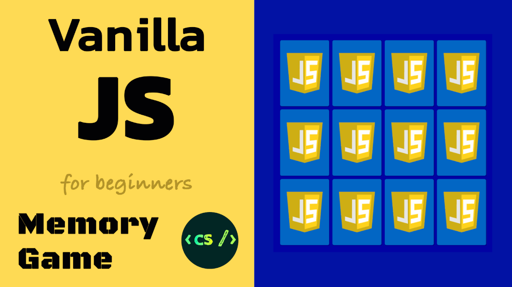

# Memory Game - Vanilla JavaScript

Project developed in vanilla javascript. No frameworks or libraries, definitely no jQuery.

* select elements in the DOM with querySelector
* iterate through lists with forEach
* add/remove an element class
* add/remove event listeners
* timeout
* html5: data-attribute
* css3: positioning, flexbox, perspective, backface-visibility, transitions

